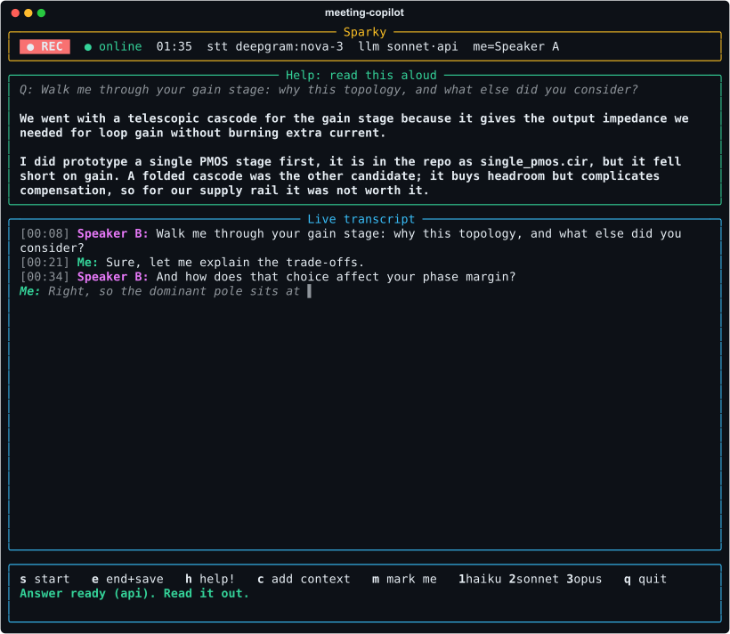
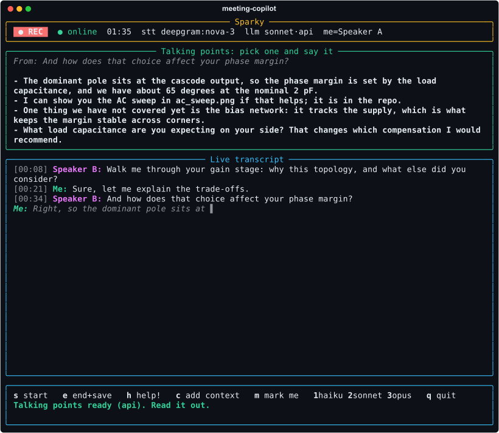

<p align="center">
  
</p>

<p align="center">
  <b>Sparky</b> is a terminal copilot for live, in-person conversations about your code.
  Launch it inside your project, it transcribes the room, and on one keypress drafts
  <b>what you would say next</b>, in the first person and grounded in <i>your</i> codebase,
  for you to read aloud: an answer if you were just asked something, talking points to
  keep the conversation going otherwise.
</p>

<p align="center">
  Built for technical interviews. It works the same way for standups, client calls,
  design reviews and architecture walkthroughs.
</p>

<p align="center">
  Website: <a href="https://danieltyukov.github.io/meeting-copilot/">danieltyukov.github.io/meeting-copilot</a>
</p>

<p align="center">
  
</p>

---

## Setup

**Requirements:** `ffmpeg`, Python >= 3.10, and the `claude` CLI (logged in).
Optional keys make it faster; both have automatic fallbacks if absent:

```bash
git clone https://github.com/danieltyukov/meeting-copilot.git && cd meeting-copilot
./install.sh           # creates a venv + installs `meeting-copilot` on your PATH
```

> **No keys required.** Without them the app still runs, using local Whisper for
> transcription and the `claude` CLI for answers. Keys only make it faster, and
> each **falls back automatically** (even mid-meeting) if it is missing or fails.

Optionally add keys to `~/.config/meeting-copilot/config.env` (chmod 600) for speed:

```ini
DEEPGRAM_API_KEY=...    # Faster streaming transcription.  Absent -> local Whisper.
ANTHROPIC_API_KEY=...   # Faster answers (~1s).            Absent / on failure -> claude CLI.
```

### Offline operation (no Wi-Fi)

A live **`● online` / `● OFFLINE`** marker sits in the header, and the app
**switches automatically mid-session** if the network drops:

| | Online | Offline (no Wi-Fi) |
|---|---|---|
| **Transcription** | Deepgram (or local Whisper) | **local Whisper**, works out of the box |
| **Answers** | Claude API -> CLI | **local LLM** via Ollama |

Transcription is fully offline already. For **offline answers**, install a local
LLM once, while you still have internet:

```bash
curl -fsSL https://ollama.com/install.sh | sh   # one-time
ollama pull qwen3:4b-instruct-2507-q4_K_M       # ~2.5 GB, the default local model
```

Qwen3 4B Instruct (2507) is the default: a non-thinking text instruct model that
answers immediately, so it stays near-real-time even on a CPU-only machine. To use
a different local model, pull it and pass `--ollama-model <ollama-tag>` (for
example `--ollama-model qwen3.5:4b` or `--ollama-model qwen3:8b-instruct`).

If Wi-Fi drops mid-meeting, transcription and answers both switch to local
automatically and the header flips to `● OFFLINE`. Run `meeting-copilot --self-test`
to check whether offline answers are ready.

Verify the full setup:

```bash
meeting-copilot --self-test
```

## Usage

```bash
cd ~/your/project
meeting-copilot
```

| Key | Action |
|-----|--------|
| `s` / `e` | **Start** / **End and save** the meeting (writes `meeting-*.md` here) |
| `h` | **Help**, draft what to say next: an answer if you were just asked something, talking points otherwise |
| `c` | Type extra context to steer the next draft |
| `m` | Mark which detected speaker is **you** |
| `1` `2` `3` | Switch answer model: haiku / sonnet / opus |
| `↑` `↓` | Scroll a long answer; `q` to quit |

### What `h` drafts

The transcript decides. If the other side has put a question to you since you last
spoke, you get a spoken-length, first-person answer to it (a lead-in and its question
are taken together, and a "Right, yes." after your reply is not mistaken for a
question). Otherwise, because you just spoke, they only acknowledged, or nothing has
been said yet, you get three to five first-person talking points that pick up from
the last thing said: something from your context they have not heard yet, and at
least one question to ask back. Before anyone speaks they are openers. The help box
shows which it chose (`Q:` or `From:`), and a note typed with `c` steers either.

<p align="center">
  
</p>

## Features

- **Near-real-time transcription**, via Deepgram streaming, with automatic fallback to local Whisper if it drops.
- **Answers and talking points grounded in your repository**, reading the directory's README, manifests, and file tree; Claude **API -> CLI -> local LLM** fallback.
- **Offline operation**, switching to local Whisper and a local LLM when Wi-Fi drops, with a live `● online / ● OFFLINE` marker.
- **Best-effort speaker separation**, telling you apart from the other voices in the room (`Speaker A`, `Speaker B`), or falling back to a plain transcript.
- **Resilient and visible**: the header always shows the live backend and tags any mid-session `(fallback)`.
- **Session transcript**, saved as Markdown on stop; fully keypress-driven; long answers scroll.

## Browser version (Google Meet / Teams)

A **visible** Chrome side-panel build lives in [`extension/`](extension/). It
transcribes a Meet or Teams call and, on Help (or `h`), drafts the same answers
and talking points in a panel, using the same Deepgram + Claude stack. Because it captures your mic and the call tab
separately, it labels your own voice exactly, and it diarizes the call tab so
several people on the far end show up as **Speaker 1 / 2 / 3** rather than one
merged block.

Every call is also written to a browsable **History** as it happens, so closing
the panel or forgetting to press Stop does not lose the transcript. Entries are
named after the first question asked of you, and can be reopened, copied,
downloaded as Markdown, renamed or deleted.

It is a normal, on-screen aid with no stealth or screen-share hiding, so use it
where you have consent. See [`extension/README.md`](extension/README.md) for
loading instructions.

## How it works

```
  mic / room audio
       │ (ffmpeg)
       ▼
  transcription ── Deepgram streaming
       │            └─ no key / drop → local Whisper
       ▼
  live transcript + your repo's context
       │   asked something?  → answer it
       │   otherwise         → talking points from the last thing said
       ▼
  Claude ── API (fast)
       │     ├─ no key / failure → claude CLI
       │     └─ offline         → local LLM (Ollama)
       ▼
  first-person draft ─▶ you read it aloud
       │
       ▼
  meeting-*.md (saved when you stop)
```

Audio capture only *forwards* bytes; transcription and answer-drafting run off the
capture loop, so the UI never blocks. Run the test suite with
`.venv/bin/python -m pytest`.

> Intended as a confidence aid and preparation tool. Cloud transcription streams
> audio to Deepgram; run `--stt local` to keep everything on-device.

## Contributing and licence

Patches and bug reports are welcome; see [`CONTRIBUTING.md`](CONTRIBUTING.md) for
the layout and the three test suites. What the tool sends where is in
[`PRIVACY.md`](PRIVACY.md), and how to report a vulnerability in
[`SECURITY.md`](SECURITY.md). MIT licence.
