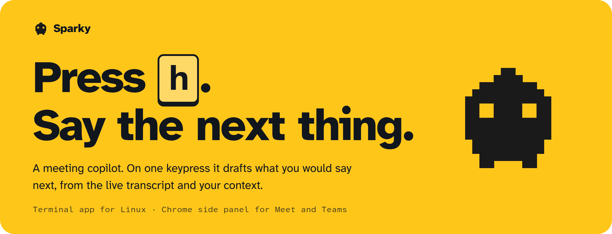
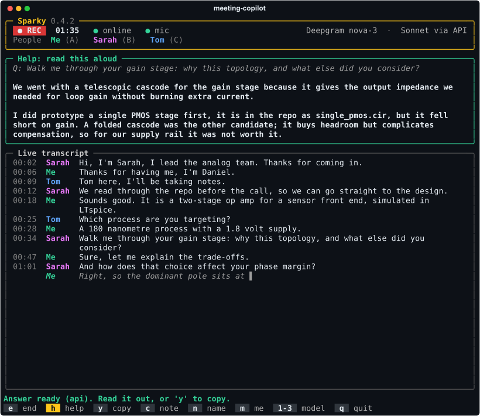
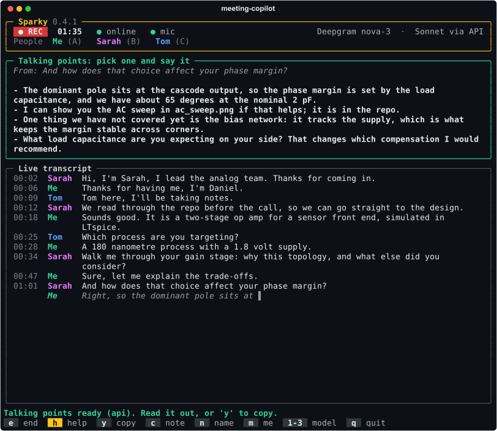

<p align="center">
  <picture>
    <source media="(prefers-color-scheme: dark)" srcset="docs/logo-dark.png">
    
  </picture>
</p>

<p align="center">
  <b>Sparky</b> is a terminal copilot for live, in-person conversations about your code.
  Launch it inside your project, it transcribes the room, and on one keypress drafts
  <b>what you would say next</b>, in the first person and grounded in <i>your</i> codebase,
  for you to read aloud: an answer if you were just asked something, talking points to
  keep the conversation going otherwise.
</p>

<p align="center">
  Built for the moment when you know the answer but the words will not come fast
  enough: brain fog, a stammer or another speech difference, nerves, or a second
  language. It works the same way for technical interviews, standups, client calls,
  design reviews and architecture walkthroughs, in the room or on a call.
</p>

<p align="center">
  Website: <a href="https://danieltyukov.github.io/meeting-copilot/">danieltyukov.github.io/meeting-copilot</a>
</p>

<p align="center">
  
</p>

---

## Setup

**Requirements:** `ffmpeg`, Python >= 3.10, and the `claude` CLI (logged in).
Optional keys make it faster; both have automatic fallbacks if absent:

```bash
git clone https://github.com/danieltyukov/meeting-copilot.git && cd meeting-copilot
./install.sh           # creates a venv + installs `meeting-copilot` on your PATH
```

> **No keys required.** Without them the app still runs, using local Whisper for
> transcription and the `claude` CLI for answers. Keys only make it faster, and
> each **falls back automatically** (even mid-meeting) if it is missing or fails.

Optionally add keys to `~/.config/meeting-copilot/config.env` (chmod 600) for speed:

```ini
DEEPGRAM_API_KEY=...    # Faster streaming transcription.  Absent -> local Whisper.
ANTHROPIC_API_KEY=...   # Faster answers (~1s).            Absent / on failure -> claude CLI.
MY_NAME=Daniel          # Optional. Drafts know who you are, and Sparky can tell your voice apart.
```

### Offline operation (no Wi-Fi)

A live **`● online` / `● OFFLINE`** marker sits in the header, and the app
**switches automatically mid-session** if the network drops:

| | Online | Offline (no Wi-Fi) |
|---|---|---|
| **Transcription** | Deepgram (or local Whisper) | **local Whisper**, works out of the box |
| **Answers** | Claude API -> CLI | **local LLM** via Ollama |

Transcription is fully offline already. For **offline answers**, install a local
LLM once, while you still have internet:

```bash
curl -fsSL https://ollama.com/install.sh | sh   # one-time
ollama pull qwen3:4b-instruct-2507-q4_K_M       # ~2.5 GB, the default local model
```

Qwen3 4B Instruct (2507) is the default: a non-thinking text instruct model that
answers immediately, so it stays near-real-time even on a CPU-only machine. To use
a different local model, pull it and pass `--ollama-model <ollama-tag>` (for
example `--ollama-model qwen3.5:4b` or `--ollama-model qwen3:8b-instruct`).

If Wi-Fi drops mid-meeting, transcription and answers both switch to local
automatically and the header flips to `● OFFLINE`. Run `meeting-copilot --self-test`
to check whether offline answers are ready.

Verify the full setup:

```bash
meeting-copilot --self-test
```

## Usage

```bash
cd ~/your/project
meeting-copilot
```

| Key | Action |
|-----|--------|
| `s` / `e` | **Start** / **End and save** the meeting (writes `meeting-*.md` here) |
| `h` | **Help**, draft what to say next: an answer if you were just asked something, talking points otherwise |
| `c` | Type extra context to steer the next draft |
| `n` | **Name** a voice by hand: `n`, the voice's letter, the name, Enter |
| `y` | Copy the last draft to the clipboard (works over SSH too) |
| `m` | Mark which detected speaker is **you** |
| `1` `2` `3` | Switch answer model: haiku / sonnet / opus |
| `↑` `↓` | Scroll a long answer; `q` to quit |

### What `h` drafts

The transcript decides. If the other side has put a question to you since you last
spoke, you get a spoken-length, first-person answer to it (a lead-in and its question
are taken together, and a "Right, yes." after your reply is not mistaken for a
question). Otherwise, because you just spoke, they only acknowledged, or nothing has
been said yet, you get three to five first-person talking points that pick up from
the last thing said: something from your context they have not heard yet, and at
least one question to ask back. Before anyone speaks they are openers. The help box
shows which it chose (`Q:` or `From:`), and a note typed with `c` steers either.

<p align="center">
  
</p>

### Names, not numbers

People nearly always say who they are, so Sparky listens for it. When a voice
says "Hi, I'm Sarah", "my name is Priya Raman" or "this is Marcus from design",
its lines read `Sarah:` from then on, and the lines it already spoke are
relabelled too. Until a voice introduces itself it stays `Speaker A`, `Speaker B`,
and so on. The rule is deliberately cautious: "I'm going to share my screen" or
"I'm Dutch" never becomes a name.

The meeting's own details help too. Save the calendar invite (`.ics`) in the
directory you launch from and Sparky reads its attendees, or pass them with
`--people "Sarah Chen, Marcus Lee"` (or `--invite path/to/invite.ics`). With that
list, "I'm Sarah" becomes **Sarah Chen**, and once Sparky knows which voice is you,
the last unnamed voice gets the last unused name, which names the other side of a
1:1 as soon as they speak. It never guesses between two candidates. The drafts get
the list as well, so they can address people properly.

Press `n` to name or rename a voice yourself (attendees from the invite are
offered as numbered picks); a name you type always wins, and an empty one hands
the voice back to automatic. Set your own name with `--me Daniel`
(or `MY_NAME=` in the config file) and two things happen: drafts know who "I" am,
and when you introduce yourself in the room Sparky marks that voice as **Me**, so
you rarely need `m`. The saved Markdown lists the participants and uses their
names throughout.

## Features

- **Near-real-time transcription**, via Deepgram streaming, with automatic fallback to local Whisper if it drops.
- **Answers and talking points grounded in your repository**, reading the directory's README, manifests, and file tree; Claude **API -> CLI -> local LLM** fallback.
- **Offline operation**, switching to local Whisper and a local LLM when Wi-Fi drops, with a live `● online / ● OFFLINE` marker.
- **Speakers by name**, picked up from introductions or typed with `n`, on top of best-effort speaker separation (`Speaker A`, `Speaker B` until a voice is named).
- **In-room feedback**: a mic dot in the header lights while speech is heard, so you know the room is reaching the transcript.
- **Resilient and visible**: the header always shows the live backend and tags any mid-session `(fallback)`.
- **Session transcript**, saved as Markdown on stop with a participants list; fully keypress-driven; long answers scroll; a newer `h` replaces a draft that is still streaming.

## Browser version (Google Meet / Teams)

A Chrome side-panel build lives in [`extension/`](extension/). It
transcribes a Meet or Teams call and, on Help (or `h`), drafts the same answers
and talking points in a panel, using the same Deepgram + Claude stack. Because it
captures your mic and the call tab separately, it labels your own voice exactly,
and it diarizes the call tab so several people on the far end are kept apart.
They are named the same way as in the terminal app: from their introductions,
completed by the participant names Meet, Teams or Zoom show on the call page,
with a **People** row of chips to rename anyone by hand.

Every call is also written to a browsable **History** as it happens, so closing
the panel or forgetting to press Stop does not lose the transcript. Entries are
named after the first question asked of you, and can be reopened, copied,
downloaded as Markdown, renamed or deleted. Press **Alt+Shift+S** on the call
tab to open Sparky there without reaching for the mouse.

See [`extension/README.md`](extension/README.md) for loading instructions.

## How it works

```
  mic / room audio
       │ (ffmpeg)
       ▼
  transcription ── Deepgram streaming
       │            └─ no key / drop → local Whisper
       ▼
  voices named from their introductions ("Hi, I'm Sarah")
       │
       ▼
  live transcript + your repo's context
       │   asked something?  → answer it
       │   otherwise         → talking points from the last thing said
       ▼
  Claude ── API (fast)
       │     ├─ no key / failure → claude CLI
       │     └─ offline         → local LLM (Ollama)
       ▼
  first-person draft ─▶ you read it aloud
       │
       ▼
  meeting-*.md (saved when you stop)
```

Audio capture only *forwards* bytes; transcription and answer-drafting run off the
capture loop, so the UI never blocks. Run the test suite with
`.venv/bin/python -m pytest`.

> Intended as a confidence aid and preparation tool. Cloud transcription streams
> audio to Deepgram; run `--stt local` to keep everything on-device.

## Contributing and licence

Patches and bug reports are welcome; see [`CONTRIBUTING.md`](CONTRIBUTING.md) for
the layout, the test suites and the end-to-end checks. What the tool sends where is in
[`PRIVACY.md`](PRIVACY.md), and how to report a vulnerability in
[`SECURITY.md`](SECURITY.md). MIT licence.
