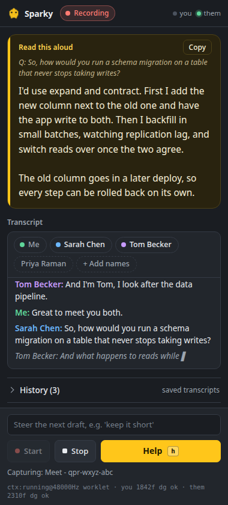

# Sparky, the Chrome extension

<p align="center"></p>

A browser version of the desktop copilot for **Google Meet and Microsoft Teams**
(web). It transcribes the call's audio live, labels each voice by name (from
introductions and from who the call page shows), and, on one click, drafts what
you would say next in a Chrome **side panel**: a first-person **answer** if you
were just asked something, **talking points** to keep the conversation going
otherwise, both grounded in the context you pasted.

## Setup

1. **Load the extension** (unpacked):
   - Open `chrome://extensions` and turn on **Developer mode** (top right).
   - Click **Load unpacked** and select this `extension/` folder.
2. **Add your keys**, by clicking the toolbar icon to open the side panel, expanding
   **Settings**, and pasting:
   - **Deepgram API key**, for streaming transcription.
   - **Anthropic API key**, which drafts the answers. *(Stored in `chrome.storage.local`
     on your machine. A client-side key is fine for personal use but is visible
     to anything with access to your profile, so do not ship this key elsewhere.)*
3. Optionally paste your **context** (résumé, project summary, agenda, job description)
   so answers are grounded in it, pick an answer model, and enter **Your name**
   (see [Names](#names)).

## Usage

1. Open your Meet or Teams call in a tab and **focus that tab**.
2. Click the extension icon (or press **Alt+Shift+S**); the side panel opens.
   The first time, a short welcome notice says what Sparky does with the call
   (including that it reads the participant names the call page shows, and
   nothing else on the page) and asks you to confirm you have consent to
   transcribe it. It is remembered after that (Settings can show it again),
   and it comes back by itself if its wording ever changes, as it did once when
   reading participant names was added.
3. Press **Start**. Chrome only lets an extension capture a tab after its
   toolbar icon was clicked on that tab, which step 2 did. If the panel was
   opened from another tab, Sparky says so; go to the call tab and click the
   Sparky icon once (under the puzzle piece if it is not pinned), or press
   **Alt+Shift+S** there, and the call joins the running recording without a
   restart. The shortcut counts exactly like the click, so it is the no-mouse
   way in mid-meeting; if another extension already holds that combination,
   pick your own at `chrome://extensions/shortcuts`. Start also asks for
   **microphone** access. It then captures two sources and the transcript fills
   in live (you still hear the call normally).
4. **Speakers are detected automatically.** Your **mic** is always **Me**. The
   call's audio is split by Deepgram diarization, so several people on the far
   end become **Speaker 1**, **Speaker 2**, **Speaker 3** (a call with one other
   voice just reads **Speaker**), and each becomes a name as soon as that
   person introduces themselves ([Names](#names)). No manual marking. The
   `you` / `them` dots in the header light up when each side is being heard, so
   you can confirm capture.
5. Press **Help** (or `h`, when the panel has focus) whenever you need
   something to say. If the other side has put a question to you since you last
   spoke, you get a spoken-length answer to it; otherwise you get three to five
   first-person talking points that pick up from the last thing said, including
   something to ask back. The box says which it chose (`Q:` or `From:`). The
   note field above the buttons steers the next draft ("keep it to two
   sentences", "bring up the migration"), and **Copy** puts the draft on the
   clipboard. Pressing Help again while a draft is still streaming replaces it.
6. Press **Stop** when done. The call is saved to **History** automatically.

## The panel

From top to bottom: the header with a status pill (Idle, Recording, Stopped)
and the `you` / `them` capture dots; the draft, set as a large yellow-edged
card because it is what you read out; the People chips heading the live
transcript; then History, Your context and Settings as folds. Start, Stop, Help
and the note field stay docked at the bottom, so Help is always one click away
whatever is scrolled. The panel follows the system light or dark theme, works
from 320 to 500 px wide, shows a focus ring for keyboard use, and drops its
small animations (the recording pulse, the drafting shimmer) when the system
asks for reduced motion.

## Names

Names come from two places: what people say about themselves, and who the
meeting itself shows.

### From introductions

People nearly always say who they are at the start of a call, so Sparky reads
the names from the transcript:

- A far-end voice is named from its first introduction in a finished line:
  "Hi, I'm Sarah", "my name is Priya Raman", "call me Alex", "this is Marcus
  from design", "Tom speaking". Interim text never names anyone, and a later
  introduction does not rename a voice that already has a name.
- Naming a voice relabels every line it already spoke, and drafts address
  people by name ("Good question, Sarah").
- The **People** chips above the transcript list every voice heard, Me first.
  Click a chip, or a speaker label in the transcript, to type a name: Enter
  or clicking away saves, Escape cancels, and an empty name returns the voice
  to its automatic label. A name you type always wins; detection never
  overwrites it.
- **Your name** in Settings is optional. Drafts are told it, and a far-end
  introduction with your name is ignored, because that is your own voice
  leaking into the call audio.
- Names are saved with the transcript. Renaming works the same in an opened
  History entry, and Copy and the Markdown download use the names.

### From the meeting

When Sparky captures the call tab, it also reads who is in the call from that
page: Meet's participant tiles and people panel, and the participant lists of
Teams and Zoom on the web. It reads display names and nothing else (no chat,
no captions, no other page text), once at capture start and every 15 seconds
while recording, and a page it cannot read just leaves the list as it was.
This uses the `activeTab` and `scripting` permissions: Chrome lets Sparky run
that one read-only function only on the tab you invoked it on (the toolbar
click or Alt+Shift+S), which is the call tab you are transcribing.

- An introduction is matched to that list, so "I'm Sarah" labels the voice
  **Sarah Chen**.
- Once every far-end voice but one has a name and exactly one name is left,
  the last voice gets it. A 1:1 call is therefore named the moment the other
  person speaks. It never guesses between two.
- People in the call who have not spoken yet show as dashed chips in the
  People row. Your own entry (the page's label for you, and Your name) is left
  out.
- **+ Add names** in the People row lets you type who is on the call, comma
  separated, for when the page cannot be read (an in-person meeting, or a call
  app Sparky does not know). Rename inputs suggest these names.
- The list goes into drafts (`PEOPLE IN THIS MEETING`) and into the saved
  transcript; the Markdown `People:` line is Me, every voice, and anyone listed
  who never spoke.
- A name you type beats an introduction, and an introduction beats a name
  given by elimination. Clearing a name elimination gave keeps it off that
  voice.

The rules are shared with the terminal app (`meeting_copilot/names.py` and
`roster.py`) and held to the same test cases (`tests/name_cases.json` and
`tests/roster_cases.json`), so both name voices alike.

## History

Every call is written to `chrome.storage.local` **as it happens**, not at Stop, so
closing the side panel mid-call or forgetting to press Stop does not lose the
transcript. Open **History** in the panel to get the last 50 calls, newest first
(older ones are pruned automatically).

Each entry is named for you: the title is the first question asked of you,
quoted, plus the call app (`"Tell me about yourself." - Meet`). If an Anthropic
key is set, Stop then upgrades that to a one-line summary of what the call was
actually about, using haiku. A failed or absent title call just leaves the quote.

Per entry you can:

- **click the title** to read the whole transcript inline, labelled and coloured
  per voice exactly as it was live, with its own People chips to rename a voice
- **Copy** it as labelled plain text
- **Download** it as Markdown to `Downloads/sparky/YYYY-MM-DD-<title>.md`, with a
  `People:` line (`Me, Sarah Chen, Tom Becker`) in its header
- **Rename** it (Enter saves, Escape cancels)
- **Delete** it, or **Clear all**

Delete and Clear all arm on the first click and fire on the second, and nothing
leaves your machine: transcripts sit in the extension's own local storage, which
is why deleting a call you would rather not keep is one click away.

## Troubleshooting: "I don't see any transcript"

Text only appears when **someone actually speaks** into a captured source. While
recording with no text yet, the panel tells you exactly what it is hearing:

- **`them … waiting for the call tab`** means the meeting tab is not producing
  audio. Make sure the **call tab** (the one you focused when pressing Start)
  actually has sound playing. If you are alone in the call, there is nothing to
  transcribe.
- **`mic off`** means Chrome **did not show the mic prompt inside the side
  panel**, so the request was auto-denied and there is no microphone icon to
  click. Press the **Fix microphone access** button that appears under
  Start/Stop: it opens a normal tab where the prompt *does* render. Click
  **Allow** there, close the tab, then press **Fix microphone access** once
  more. The grant is keyed to the extension, so the side panel inherits it, and
  the mic binds to the recording already in progress (no Stop/Start round trip,
  and nothing already transcribed is lost). Until that succeeds your own voice
  has no channel of its own, which is why it can end up attributed to the call.

**Definitive 30-second self-test (no call needed):** open any tab playing speech,
for example a talking **YouTube** video, focus that tab, open the side panel,
press **Start**, then switch back to the video. Within a second or two you will
see **`Speaker:`** lines fill in. That confirms the capture -> Deepgram ->
display path end-to-end. (Run `node extension/test_render.cjs` to verify the
rendering path in code, `node extension/test_history.cjs` for the history path,
and `node extension/test_names.cjs` for name detection.)

## How it works

```
  your mic ──────────────────→ Deepgram ──────────→ "Me"        ┐
  meeting tab (tabCapture) ───→ Deepgram (diarize) ─→ name, or    ┘─→ live transcript
                                                      "Speaker N"│
                                                                 │
   your context + transcript + the question, or the last line ────┼─→ Anthropic API
                                                                 ↓
                                  an answer, or talking points, in the side panel
```

- Cloud-only by nature (a browser cannot run local Whisper or a local LLM the way
  the desktop app does), so it needs internet and both API keys.
- Auth quirks handled: Deepgram over the browser WebSocket uses the
  `["token", key]` subprotocol; Anthropic uses the
  `anthropic-dangerous-direct-browser-access` header.

## Limitations

- Captures **two sources**: your microphone (which becomes "Me") and the meeting
  tab's audio (which becomes "Speaker N", or a name). Which *side* you are on is exact,
  because it comes from the capture source rather than a guess. Telling the
  far-end voices apart is Deepgram diarization, so it is good but not infallible:
  voice indices can drift on heavy crosstalk, and the numbering and the names
  restart on each Start. The first Start needs mic permission.
- Introductions are read with a plain rule over the words, so one phrased some
  other way ("Sarah, platform lead") is missed and a rare false one can slip
  in. Reading who is in the call depends on markup Meet, Teams and Zoom change
  without notice, so it is best effort; **+ Add names** covers a page it cannot
  read. Click a chip to fix any name.
- If you run on speakers rather than headphones, your mic also hears the call.
  Browser echo cancellation plus a text-level duplicate filter (a line arriving
  on both sources within a few seconds is dropped) keeps that out of the
  transcript. Short backchannels like "yes" are deliberately never filtered.
- Personal-use tool: keys live client-side; there is no server. Saved transcripts
  live in the same local storage, unencrypted, so anything with access to your
  Chrome profile can read them.
